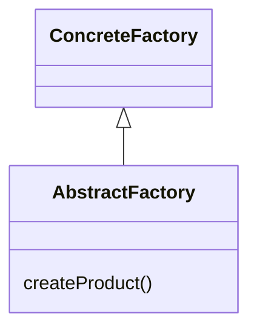
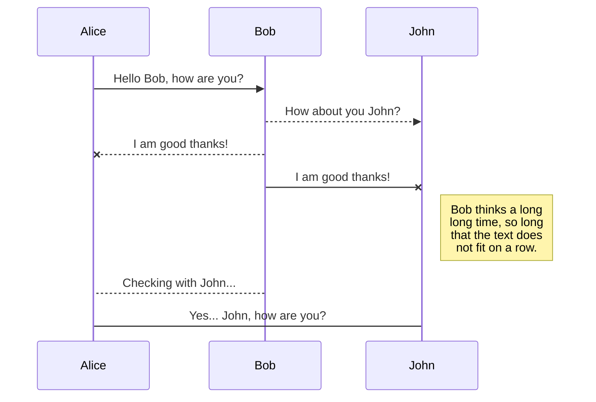

# [GoF之工厂方法模式-FactoryMethod（创建型、对象模式）]()
工厂方法模式：创建一个产品对象的工厂接口，将产品对象的实际创建工作推迟到具体子工厂中，使对象的创建和使用分类。  

# 模式结构
工厂方法模式有抽象工厂、具体工厂、抽象产品、具体产品4个要素构成。
- 抽象工厂：通过创建产品的接口，调用者通过它访问具体工厂的工厂方法来创建产品
- 具体工厂：完成具体产品的创建
- 抽象产品：定义了产品的规范，描述了产品的主要特征和功能
- 具体产品：与具体工厂一一对应

# 一般类图

